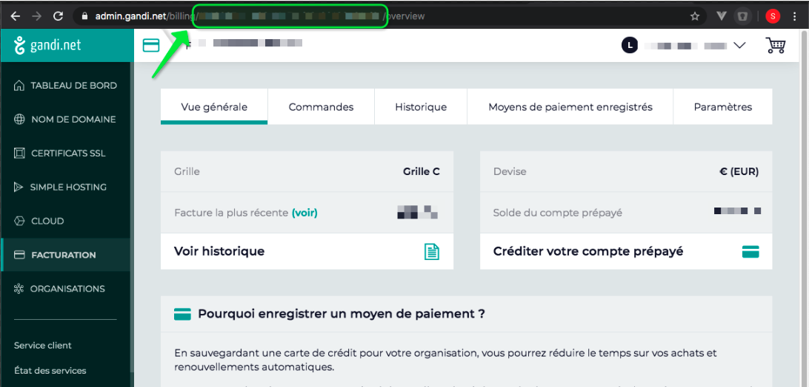

# gandi-tools
GANDI.NET Invoice Scraper and Parser

## GANDI SCRAPER

### Installation
```bash
npm i gandi-invoice
cp .env.sample .env
```

### Configuration
1. Edit file `.env` with the editor of your choice.
2. Set your Gandi's username and password.
3. Set your Gandi's UID/Token

### Where to find the GANDI's user UID/Token
1. Go to your Gandi's account : https://id.gandi.net/fr/login and login
2. Go to the desired invoice/billing section
3. Look at the URL and extract the token (green rectangle on screenshot)



Note : You may have more than one billing token on your account. That's why you need to set it manually in environement variables.

### Usage
```bash
node check_scrap.js
```

